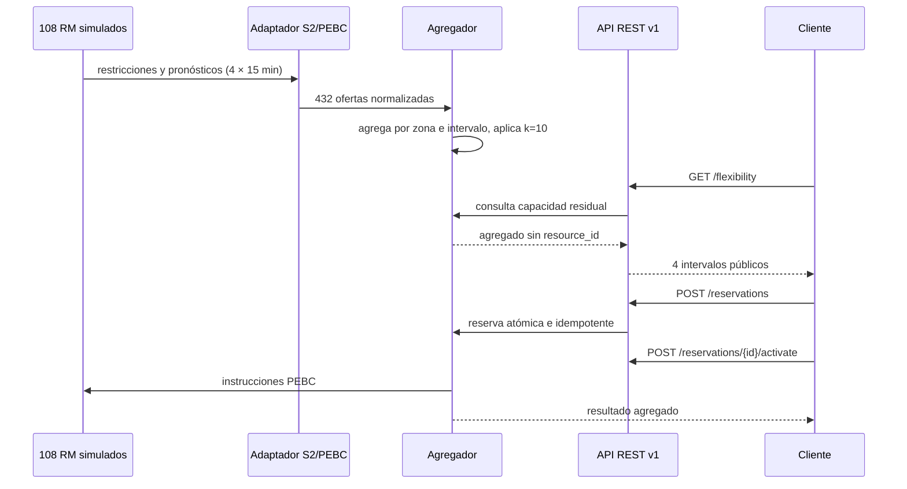

# Hito 5 — Endurecimiento y experiencia de uso

**Estado:** completado el 12 de septiembre de 2026.

## Resultado

La demo arranca con un único comando y publica una hora de flexibilidad sintética para
108 DER heterogéneos: 36 baterías, 36 cargadores VE y 36 bombas de calor, repartidos en
tres zonas. Cada zona supera el umbral de privacidad `k=10` y expone cuatro intervalos de
15 minutos sin identificadores individuales.

```powershell
docker compose up --build
```

Una vez que el servicio figure como `healthy`, la documentación interactiva está en
<http://127.0.0.1:8000/docs>. La colección de ejemplo está en `examples/demo.http`.

## Flujo de la demo



## Controles añadidos

- Límite de 32 KiB para cuerpos HTTP, incluso con transferencia fragmentada.
- JSON de reserva estricto: los campos desconocidos se rechazan.
- Reservas con zona horaria obligatoria y callbacks HTTPS sin credenciales, IP locales
  ni redirecciones automáticas.
- Claves de idempotencia limitadas a 128 caracteres.
- `X-Request-ID` para correlación y contador Prometheus en `GET /metrics`.
- Logs JSON mínimos: método, estado, duración e ID de petición; no registran URL,
  consulta, cabeceras, cuerpo ni identificadores de DER.
- El simulador ya no depende de archivos alojados bajo `tests/`, por lo que el wheel y
  la imagen contienen todo lo necesario en tiempo de ejecución.
- Auditoría reproducible con `pip-audit` como dependencia de desarrollo.
- Fuzzing local con semillas fijas para que cada caso y cada fallo sean reproducibles.
- Puerta de mutación local que solo acepta una mutación como eliminada cuando pytest
  devuelve un fallo de aserción; errores de colección o infraestructura no cuentan.

## Evidencias verificadas

| Comprobación | Resultado local |
|---|---:|
| Ruff | sin incidencias |
| mypy | sin incidencias en 51 archivos de código y tests |
| pytest | 101 pruebas superadas, incluidas regresiones LF/CRLF, gzip, bootstrap limpio, contenedor y procedencia offline |
| Fuzzing determinista | 1.205 entradas por ejecución sin errores internos ni fuga de identificadores |
| Mutación dirigida | 6/6 mutantes eliminados, puntuación 100 % |
| Trazabilidad | 17 claims y referencias resueltas automáticamente |
| Instalación offline | 17 wheels, 15 componentes, hashes obligatorios y `pip check` limpio |
| Bundle de revisión | ZIP determinista; alteraciones y archivos inesperados detectados |
| Sesión S2 | 16 mensajes wire validados |
| `pip check` | sin requisitos rotos |
| `pip-audit .` | sin vulnerabilidades conocidas en dependencias de producción |
| `pip-audit --local --skip-editable` | sin vulnerabilidades conocidas en el entorno de desarrollo |
| Docker Compose | imagen construida; contenedor `healthy` |
| Escala de aceptación | 108 recursos, 432 ofertas, una hora |
| Rendimiento ampliado | 1.008 recursos, 96.768 ofertas, 96 intervalos |
| p95 HTTP de consulta ampliada | 100,683 ms; objetivo < 500 ms |

El CI audita por separado la resolución de producción y todo el entorno de desarrollo.
El resultado refleja únicamente las bases consultadas al ejecutarlo; no sustituye
revisiones periódicas ni un análisis de producción.

## Casos de fallo cubiertos

- Duplicados e idempotencia.
- Reserva concurrente sin doble venta.
- Caducidad de ofertas y reservas con liberación de capacidad.
- Desconexión y supresión por privacidad.
- Supresión estable de una celda ya publicada si cambia su cohorte o cualquier oferta,
  para impedir diferencias simples entre consultas sucesivas.
- Supresión del delta de capacidad residual tras reservas y de cohortes distintas en
  intervalos adyacentes.
- Pronósticos desalineados con remuestreo conservador.
- Cambio de hora de Madrid manteniendo intervalos UTC contiguos.
- Replay antiguo, reutilización conflictiva de versión y restricciones físicas infladas.
- Agotamiento energético multiintervalo, pronóstico fuera del SoC operativo y límite
  de rampa en ambas direcciones.
- Recurso desconocido, deshabilitado o en otra zona; versión de aprovisionamiento
  antigua o conflictiva; límites no finitos y restricciones S2 falsificadas.
- Cien trayectorias multiintervalo aleatorias y reservas repartidas entre cuatro
  intervalos sin superar el presupuesto energético común.
- Reinicio de secuencia en una época nueva, replay de sesión anterior, reconexión sin
  avance, invalidación de horizonte y fronteras de reloj antiguas/futuras.
- `NaN`, infinitos, potencia excesiva, límites físicos absurdos, horizonte S2 superior
  a un día y serialización segura de errores 422.
- Agregación determinista ante permutaciones de llegada, 100 envolventes físicas
  aleatorias y una ráfaga de 100 intentos concurrentes sin sobreasignación.
- JSON arbitrario y bytes malformados sin respuestas 5xx; mutaciones numéricas S2
  rechazadas o físicamente acotadas; duraciones OpenADR siempre positivas y ≤ 24 h.
- Rechazo parcial de activación y webhook caído con reintentos.

Existe un único aviso de deprecación procedente de la combinación Starlette/AnyIO en
el cliente de pruebas. No se origina en código del proyecto ni afecta la ejecución del
servicio; se conserva visible para detectar cuándo la dependencia lo retire.

La puntuación de mutación se limita deliberadamente a seis reglas de alto riesgo y no
equivale a una exploración exhaustiva de todos los operadores del código. El catálogo,
las pruebas responsables y el resultado están en `scripts/mutation_gate.py` y
`build/local-verification/mutation-report.json`.
